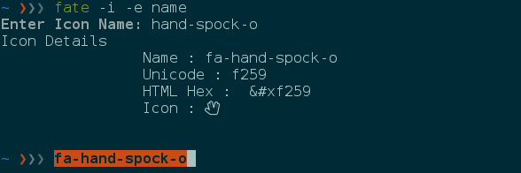
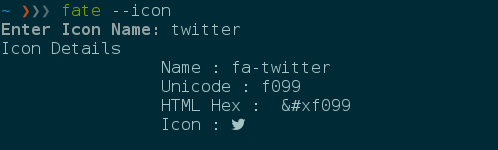
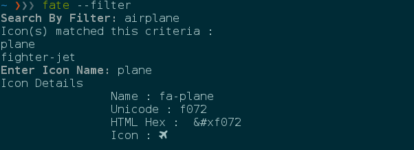
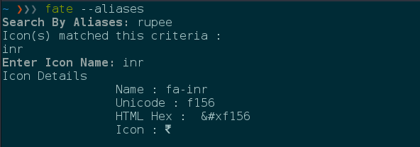
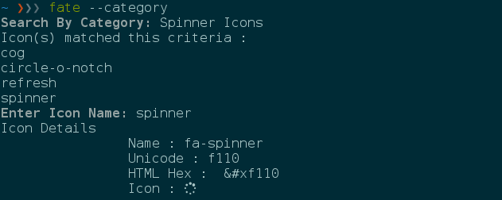

fate
====

|Github All Releases| |version| |supported| |Twitter| |GitHub license|
|forthebadge| >fate is a simple CLI program which let's you browse
FontAwesome icons on your terminal. Note : Python3+ only.

Install Instructions : ``pip install fate`` or
``pip install git+https://github.com/mr-karan/fate.git``

|asciicast|

Avilable commands :
~~~~~~~~~~~~~~~~~~~

To browse all the icons
^^^^^^^^^^^^^^^^^^^^^^^

``fate --icon``

|icon| #### To narrow down you search with FontAwesome filter tags, use
--filter or -f ``fate -filter``

|icon| #### To narrow down your search with aliases tag, use --aliases
or -a ``fate --aliases``

|icon| #### To narrow down your search with categories tag, use
--category or -c ``fate --category``

|icon| #### To echo the icon ``[name/ unicode/ html]`` hex use it with
-e or --echo #####Example : ``fate -i -e name``

   icon

What's with the name ?
~~~~~~~~~~~~~~~~~~~~~~

Well, 'F'ont'A'wesome on 'Te'rminal = "fate" :) Credits to my good
friend [@Kush](https://twitter.com/BurstDragon)

For the icons to display properly on your system, you need to have
FontAwesome fonts installed. Grab the otf files from
`here <https://fortawesome.github.io/Font-Awesome/>`__ You will need to
install this font on your system for icons to be rendered properly.

For Windows users : - pip install would most likely fail to install
``pyyaml``, since ``PyYAML`` isn't actively maintained. You need to grab
it manaully from
`here <http://www.lfd.uci.edu/~gohlke/pythonlibs/#pyyaml>`__ - If you
are using ``cmd`` god bless you. Change the character map using
``chcp 65001``. Check
`here <http://stackoverflow.com/questions/14109024/how-to-make-unicode-charset-in-cmd-exe-by-default>`__
for additional instructions.

License
~~~~~~~

    MIT © Karan Sharma

    `LICENSE included here <LICENSE>`__

.. |Github All Releases| image:: https://img.shields.io/github/downloads/mr-karan/fate/total.svg
   :target: 
.. |version| image:: https://img.shields.io/pypi/v/fate.svg
   :target: https://pypi.python.org/pypi/fate/
.. |supported| image:: https://img.shields.io/pypi/pyversions/fate.svg
   :target: https://pypi.python.org/pypi/fate/
.. |Twitter| image:: https://img.shields.io/twitter/url/https/pypi.python.org/pypi/fate.svg?style=social?style=flat-square
   :target: https://twitter.com/intent/tweet?text=Wow:&url=%5Bobject%20Object%5D
.. |GitHub license| image:: https://img.shields.io/badge/license-MIT-blue.svg
   :target: https://raw.githubusercontent.com/mr-karan/fate/master/LICENSE
.. |forthebadge| image:: http://forthebadge.com/images/badges/built-with-love.svg
   :target: http://forthebadge.com
.. |asciicast| image:: https://asciinema.org/a/9oyqtsd9r6xh3ppryiy0yu14r.png
   :target: https://asciinema.org/a/9oyqtsd9r6xh3ppryiy0yu14r

